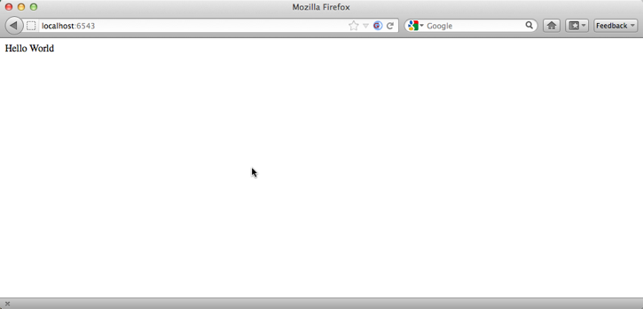
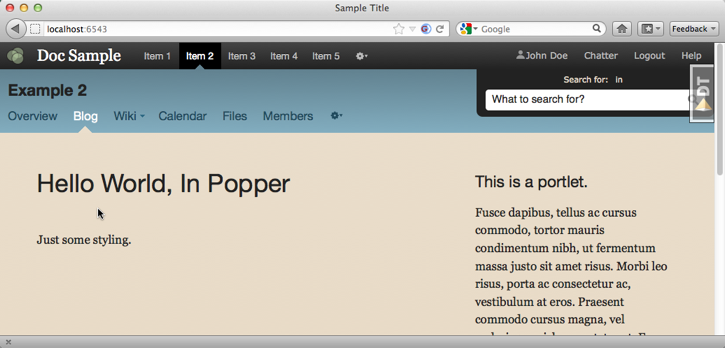
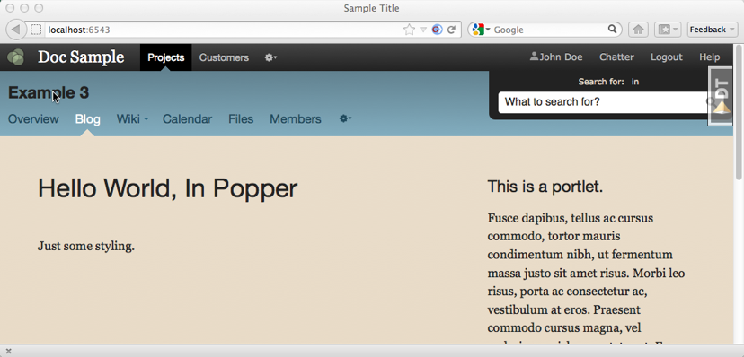

============
Using Popper
============

Adding an existing layout such as Popper to your Pyramid application is
a straightforward process. In this section we show the basics,
including how to fill in the blanks and customize/override.

.. note::

    The package for the ``example`` application below,
    and each variation of example1-X,
    is in the ``pyramid_bottlecap/docs/`` source tree. You can install
    the example package an use a symlink from one of the examples to
    ``example`` to run one of them.

Starting Point
==============

Imagine we have a starting point, a package with an ``__init__.py``:

.. literalinclude:: example/example1/__init__.py

We have a ``views.py``:

.. literalinclude:: example/example1/views.py

...and a template at ``templates/index.pt``:

.. literalinclude:: example/example1/templates/index.pt
   :language: html

This is a very simple Pyramid app with no layout:

As a starting point:

- A simple wsgi app, published with a config.scan pointed at views

- One view, with one ZPT template

.. note::

    The example sources ship with WebTest tests, but we aren't showing
    them in this walkthrough for the sake of brevity.

Example 2: Plugging in Popper
=============================

Let's now do the same thing, but have our view templates rendered using
the Popper layout. Our ``__init__.py`` adds a config include:

.. literalinclude:: example/example2/__init__.py
    :linenos:
    :emphasize-lines: 8

Only a small change in the project title in ``views.py``:

.. literalinclude:: example/example2/views.py
    :linenos:
    :emphasize-lines: 11

Our view template heads over into ZPT macro-land for
``templates/index.pt``:

.. literalinclude:: example/example2/templates/index.pt
    :linenos:
    :language: html
    :emphasize-lines: 1

We ask for a layout with a macro of ``main_template``. This is just a
convention, similar to ``self`` in Python. It refers to the
currently-chosen layout, using Bottlecap's system of registering and
choosing layouts.

We can now see the Popper layout spring into action:

Example 3:
=============================

That's a sexy-looking layout. But it doesn't have my information in it.
I don't want a global nav menu with "Item 1", "Item 2" in it. I want
"Projects" and "Customers".

Layouts have "panels" which can be overriden using Pyramid-like
machinery, so let's do so. First, let's tell ``__init__.py`` to scan a
(newly-created) panels module:

.. literalinclude:: example/example3/__init__.py
    :linenos:
    :emphasize-lines: 10

Again, only a small change in the project title in ``views.py``:

.. literalinclude:: example/example3/views.py
    :linenos:
    :emphasize-lines: 11

No change in the ZPT for our view template. But we do have a new file
``panels.py`` where we override the built-in ``popper.global_nav`` panel:

.. literalinclude:: example/example3/panels.py
    :linenos:

This ``panels.py`` introduces the heart of Bottlecap:

- Bottlecap defines a new decorator (and configuration directive)
  called ``panel_config`` which lets you create a new panel. Or in this
  case, override a built-in panel.

- We point this directive a ``popper.global_nav``,
  which is the name of panel at the top.

- Panels have templates and data/logic that go with them. We don't want
  to change the template, so we point at the built-in one. But we do
  want to change the calculation of the menu items.

- Values returned by the panel function can be used in template for
  that panel.

- This panel is called by the ``popper_layout.pt`` template,
  which does so with the following ZPT expression::

    ${panel('popper.global_logo')}

- Panel function signatures can also ask for arguments, which can
  be passed in when the expression calls the panel::

    ${panel('popper.global_logo', height=90)}
    def global_nav(context, request, height):

  This is a handy way to pass information from the calling scope (your
  view) to the callee scope (the panel function.)

The global nav menu at the top now has our stuff in it:

Later
=====

Static asset overriding, template overriding,